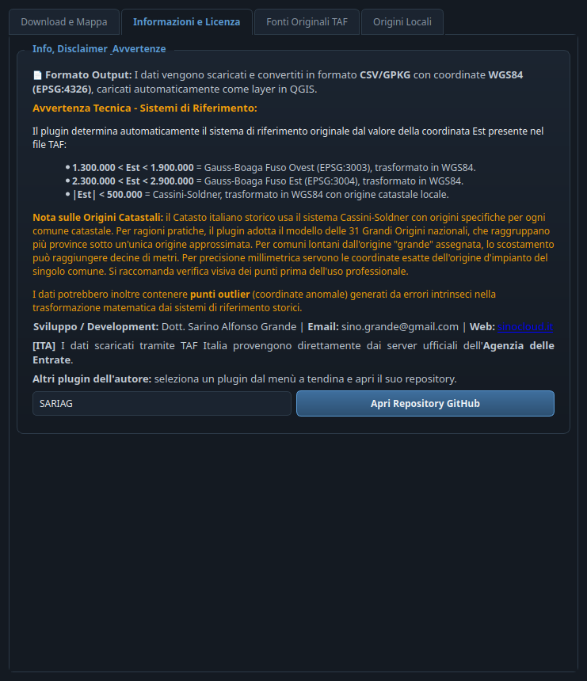

# 📍 TAF Italia for QGIS

> **IT** · Scarica i **Punti Fiduciali catastali (TAF)** dai server ufficiali dell'Agenzia delle Entrate, li converte da Cassini-Soldner/Gauss-Boaga a **WGS84 (EPSG:4326)** e li carica in QGIS già tematizzati, con link alle monografie ufficiali.
>
> **EN** · Downloads the **cadastral Fiducial Points (TAF)** from the official servers of the Italian Revenue Agency, converts them from Cassini-Soldner/Gauss-Boaga to **WGS84 (EPSG:4326)** and loads them into QGIS already styled, with links to the official monographs.

**🌐 Lingua / Language:** [🇮🇹 Italiano](#-italiano) · [🇬🇧 English](#-english)

---

## 📸 Screenshot

| Scheda Download e Mappa / Download and Map tab | Scheda Informazioni / Information tab |
|---|---|
|  |  |

> **IT** · A sinistra la scheda principale con ricerca comune, mappa OSM e console di log; a destra la scheda informazioni con avvertenze tecniche e menù a tendina degli altri plugin. · **EN** · On the left the main tab with municipality search, OSM map and log console; on the right the information tab with technical warnings and the drop-down of the other plugins.

## 🇮🇹 Italiano

### Cos'è
Ogni giorno tecnici catastali, geometri e ingegneri devono scaricare e usare i Punti Fiduciali. Il flusso ufficiale (browser Agenzia delle Entrate → file TAF → conversione manuale con tool esterni → QGIS) è lento e ripetitivo: **TAF Italia** automatizza tutto in un click.

### ✨ Funzionalità
| | Funzionalità | Descrizione |
|---|---|---|
| ⬇️ | **Download automatico** | Session HTTP con retry/backoff; verifica e download **paralleli** di tutti gli uffici provinciali (fino a 6 per provincia). |
| 🧭 | **Riconoscimento CRS automatico** | Dalle soglie della coordinata Est: Gauss-Boaga Fuso Ovest (EPSG:3003), Fuso Est (EPSG:3004) o Cassini-Soldner. |
| 🔁 | **Conversione a WGS84** | Gauss-Boaga via EPSG ufficiali (pyproj/PROJ); Cassini-Soldner su ellissoide Bessel con parametri Bursa-Wolf Roma40→WGS84. |
| 🗺️ | **Mappa OSM integrata** | Anteprima OpenStreetMap con geocoding Nominatim e centratura automatica sul comune scelto. |
| 🏷️ | **Tematizzazione automatica** | Marker triangolare verde, etichette `PF/FG/COM`, azione cliccabile "Apri Monografia PF" sul layer. |
| 🗃️ | **Output CSV/GPKG** | GeoPackage nativo PyQGIS (senza geopandas), con fallback CSV. |
| 🏛️ | **Editor Origini Locali** | Scheda dedicata con tabella modificabile delle Piccole Origini Cassini-Soldner: export modello CSV, import CSV/JSON, salvataggio a caldo. |
| 🌐 | **Interfaccia bilingue IT/EN** | Pulsante bandiera 🇮🇹/🇬🇧 accanto al titolo; la lingua scelta viene ricordata. |
| 🎨 | **Tema scuro "slate blue"** | Tema condiviso della famiglia di plugin SinoCloud (lo stesso di SARIAG e STAC Browser). |
| 🔗 | **Scheda Info con menù a tendina** | Elenco degli altri plugin dell'autore con apertura diretta del repository GitHub. |

### 🚀 Come funziona
1. Apri **TAF Italia** dalla toolbar o dal menù **Vettore**.
2. Nella scheda **Download e Mappa** digita o scegli il comune (completamento automatico) e premi **SCARICA E MOSTRA IN MAPPA (OSM)**.
3. Il plugin scarica i file TAF della provincia, riconosce il sistema di riferimento, converte in WGS84 e carica i layer già tematizzati; la console di log (a scomparsa) mostra ogni passaggio.
4. Click destro su un punto → **Apri Monografia PF** per la monografia ufficiale nel browser.
5. Nella scheda **Origini Locali** puoi inserire le Piccole Origini del tuo comune per la massima precisione (vedi Avvertenze).
6. La scheda **Fonti Originali TAF** elenca i link ufficiali di download per tutte le province.

### ⚠️ Avvertenze e limitazioni tecniche
1. **Origini Cassini-Soldner**: il Catasto storico conta oltre **818 piccole origini** comunali; di default il plugin adotta le **31 Grandi Origini** nazionali raggruppate per provincia. Per comuni lontani dall'origine assegnata lo scostamento può raggiungere **decine di metri**. *Soluzione*: l'editor **Origini Locali** permette di inserire l'origine esatta del proprio comune.
2. **Parametri Bursa-Wolf fissi**: il set Roma40 non è ottimale per tutto il territorio (Sicilia e Sardegna hanno datum locali diversi). Per precisione catastale (<1 m) servono parametri regionali.
3. **Soglie di rilevamento CRS**: valori di Est al confine tra due sistemi (~1.3M o ~2.3M) possono dare riconoscimento ambiguo.
4. **Affidabilità server ADE**: il plugin gestisce i timeout ma non può aggirare l'indisponibilità del servizio.
5. **Punti outlier**: possibili coordinate anomale generate dalla trasformazione dai sistemi storici — verifica visiva raccomandata prima dell'uso professionale.

Opzioni utili: **Scarica TAF Grezzi** (nessuna trasformazione) e **Prova conversione WGS84** (usa la Grande Origine come fallback).

> Il plugin non è un software di certificazione metrica, ma un tool operativo che automatizza il workflow TAF. Per certificazioni di precisione, verificare origini locali e parametri con un geodeta abilitato.

### 🛠️ Installazione
1. Scarica il repository o il pacchetto ZIP.
2. In QGIS: **Plugin → Gestisci e installa plugin… → Installa da ZIP**, oppure copia la cartella in `~/.local/share/QGIS/QGIS3/profiles/default/python/plugins/` (Linux) / `%APPDATA%\QGIS\QGIS3\profiles\default\python\plugins\` (Windows).
3. Attiva **TAF Italia** dall'elenco dei plugin installati. Richiede i moduli Python `requests` e `pyproj` (inclusi nelle distribuzioni QGIS standard) e una connessione internet.

---

## 🇬🇧 English

### What it is
Every day cadastral technicians, surveyors and engineers need to download and use the Italian Fiducial Points. The official flow (Revenue Agency website → TAF files → manual conversion with external tools → QGIS) is slow and repetitive: **TAF Italia** automates everything in one click.

### ✨ Features
| | Feature | Description |
|---|---|---|
| ⬇️ | **Automatic download** | HTTP session with retry/backoff; **parallel** check and download of all the provincial offices (up to 6 per province). |
| 🧭 | **Automatic CRS detection** | From the Easting value thresholds: Gauss-Boaga West zone (EPSG:3003), East zone (EPSG:3004) or Cassini-Soldner. |
| 🔁 | **WGS84 conversion** | Gauss-Boaga through official EPSG codes (pyproj/PROJ); Cassini-Soldner on the Bessel ellipsoid with Rome40→WGS84 Bursa-Wolf parameters. |
| 🗺️ | **Embedded OSM map** | OpenStreetMap preview with Nominatim geocoding and automatic centering on the chosen municipality. |
| 🏷️ | **Automatic styling** | Green triangular marker, `PF/FG/COM` labels, clickable "Open PF Monograph" action on the layer. |
| 🗃️ | **CSV/GPKG output** | Native PyQGIS GeoPackage (no geopandas), with CSV fallback. |
| 🏛️ | **Local Origins editor** | Dedicated tab with an editable table of the Cassini-Soldner Small Origins: CSV template export, CSV/JSON import, hot reload. |
| 🌐 | **Bilingual IT/EN interface** | Flag button 🇮🇹/🇬🇧 next to the title; the chosen language is remembered. |
| 🎨 | **"Slate blue" dark theme** | Shared theme of the SinoCloud plugin family (the same as SARIAG and STAC Browser). |
| 🔗 | **Info tab with drop-down** | List of the author's other plugins with direct GitHub repository opening. |

### 🚀 How it works
1. Open **TAF Italia** from the toolbar or the **Vector** menu.
2. In the **Download and Map** tab type or pick the municipality (autocomplete) and press **DOWNLOAD AND SHOW ON MAP (OSM)**.
3. The plugin downloads the province's TAF files, detects the reference system, converts to WGS84 and loads the already-styled layers; the collapsible log console shows every step.
4. Right-click a point → **Open PF Monograph** for the official monograph in the browser.
5. In the **Local Origins** tab you can enter the Small Origins of your municipality for maximum precision (see Warnings).
6. The **Original TAF Sources** tab lists the official download links for every province.

### ⚠️ Technical warnings and limitations
1. **Cassini-Soldner origins**: the historical cadastre has more than **818 municipal small origins**; by default the plugin adopts the **31 national Great Origins** grouped by province. For municipalities far from their assigned origin the offset can reach **tens of metres**. *Solution*: the **Local Origins** editor lets you enter the exact origin of your municipality.
2. **Fixed Bursa-Wolf parameters**: the Rome40 set is not optimal for the whole territory (Sicily and Sardinia have different local datums). Cadastral precision (<1 m) requires regional parameters.
3. **CRS detection thresholds**: Easting values at the boundary between two systems (~1.3M or ~2.3M) can be ambiguous.
4. **Revenue Agency server reliability**: the plugin handles timeouts but cannot work around service unavailability.
5. **Outlier points**: anomalous coordinates produced by the transformation from the historical systems are possible — visual verification is recommended before professional use.

Useful options: **Download raw TAF** (no transformation) and **Try WGS84 conversion** (uses the Great Origin as fallback).

> The plugin is not a metric certification software but an operational tool that automates the TAF workflow. For precision certifications, verify local origins and parameters with a qualified geodesist.

### 🛠️ Installation
1. Download the repository or the ZIP package.
2. In QGIS: **Plugins → Manage and Install Plugins… → Install from ZIP**, or copy the folder into `~/.local/share/QGIS/QGIS3/profiles/default/python/plugins/` (Linux) / `%APPDATA%\QGIS\QGIS3\profiles\default\python\plugins\` (Windows).
3. Enable **TAF Italia** in the installed plugins list. Requires the `requests` and `pyproj` Python modules (bundled with standard QGIS distributions) and an internet connection.

---

## 📊 Fonte dati / Data source
Dati © **Agenzia delle Entrate** — servizio [TAF](https://www1.agenziaentrate.gov.it/servizi/TafDis/download.php), Licenza Open Data **CC-BY**. Il plugin non è affiliato all'Agenzia delle Entrate. / Data © **Italian Revenue Agency** — [TAF](https://www1.agenziaentrate.gov.it/servizi/TafDis/download.php) service, **CC-BY** Open Data license. The plugin is not affiliated with the Italian Revenue Agency.

## 👤 Autore / Author
Sviluppato da / Developed by **Dott. Sarino Alfonso Grande** — *scritto e rivisto con l'ausilio dell'AI / written and reviewed with the help of AI*.
- ✉️ **Email:** [sino.grande@gmail.com](mailto:sino.grande@gmail.com)
- 🌐 **Sito ufficiale / Official website:** [sinocloud.it](https://sinocloud.it)
- 🐙 **GitHub:** [sag1687](https://github.com/sag1687)

### Altri plugin dell'autore / Other plugins by the author
| Plugin | Repository |
|---|---|
| **SARIAG** | [github.com/sag1687/sariag](https://github.com/sag1687/sariag) |
| **STAC Browser** | [github.com/sag1687/stac_browser](https://github.com/sag1687/stac_browser) |
| **GeoBridge** | [github.com/sag1687/geobridge](https://github.com/sag1687/geobridge) |
| **Quick CRS Fixer** | [github.com/sag1687/CRS_FIXER](https://github.com/sag1687/CRS_FIXER) |
| **GeoCSV Mapper** | [github.com/sag1687/GeoCSV-Mapper](https://github.com/sag1687/GeoCSV-Mapper) |
| **Q-Press** | [github.com/sag1687/q_press](https://github.com/sag1687/q_press) |
| **QGIS Ledger** | [github.com/sag1687/qgis_ledger](https://github.com/sag1687/qgis_ledger) |

## 📜 Licenza / License
**GPL-2.0** — Copyright © 2026 Dott. Sarino Alfonso Grande.
Questo plugin è software libero, ridistribuibile secondo i termini della GNU GPL v2. / This plugin is free software, redistributable under the terms of the GNU GPL v2.
